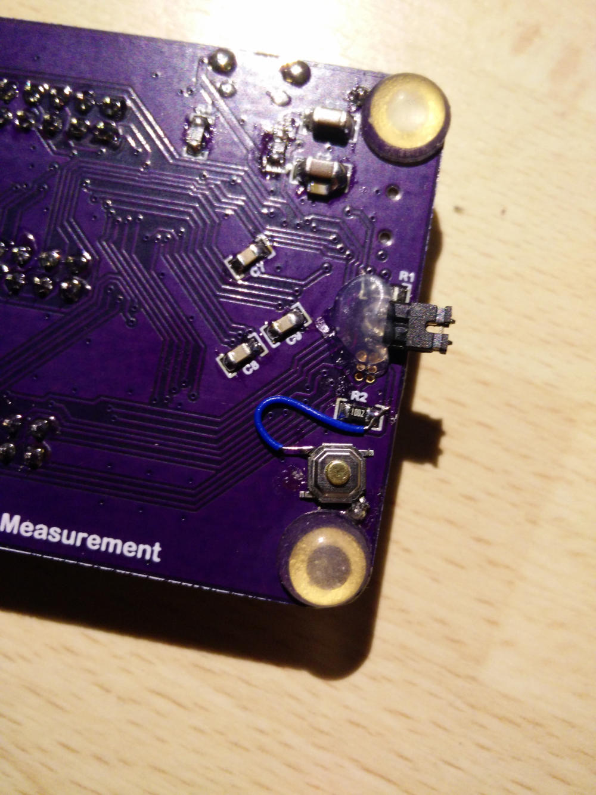

Errata
------

- JP1 - bad footprint, too fine pitch. Can be fixed by soldering the header on the bottom, with slightly bent pins
- P1 - the SWD connector, same problem, no fix needed or available. Use DFU for flashing
- Missign NRESET button. Normally not needed, but often missed. You can solder it on the bottom side from one end of R2 to the GND testpoint.

