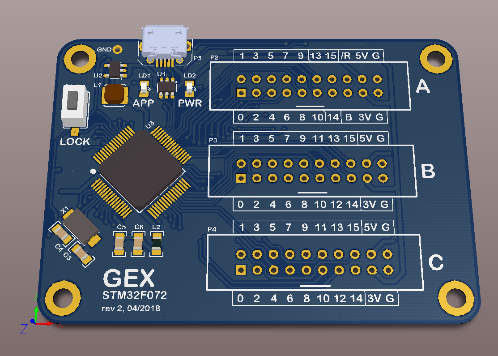

GEX F072 hub prototype board
============================

This board was the first custom PCB for GEX.

To flash a firmware, remove JP1, reset and flash using DFU. Replace JP1 and reset for normal operation.

Press and hold S1 to enable USB VFS with config files. Same process for locking and persisting to Flash.
Settings (but not system settings) can also be changed via the USB API.

rev.2 changes
-------------

The BOOT jumper is now inside the A connector, 
and the function is reversed - insert a jumper between BOOT and 3V3 to enter bootloader.

