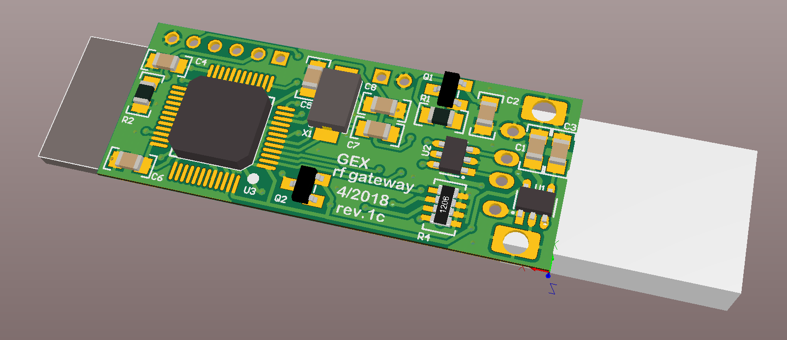

GEX Radio Dongle
================

This board is a GEX accessory. It conencts to GEX Zero (or other GEXes with the NRF module)
and provides UART-like connection using a USB virtual comport.

The board is fitted with a USB type A connector, a reset button and a debug header.
A NRF24L01+ is soldered onto the PCb and the flat antenna sticks outside the board for better transmission.

There are no GPIOs broken out due to the limited board size, other than those used for the radio module. This, however, 
includes full SPI and 3 other GPIOs, which could be used for other applications if the NRF module is not installed.

This board uses STM32F103C8T6 (same like Bluepill), so the firmware should be bluepill compatible.

