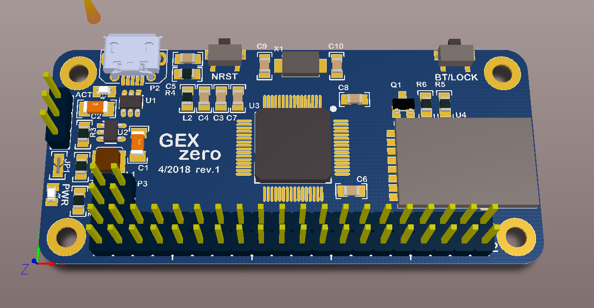
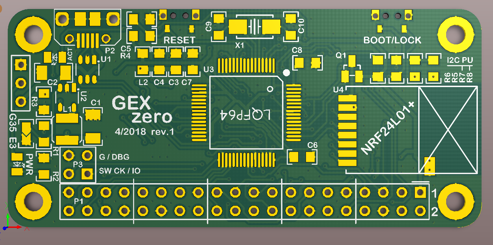
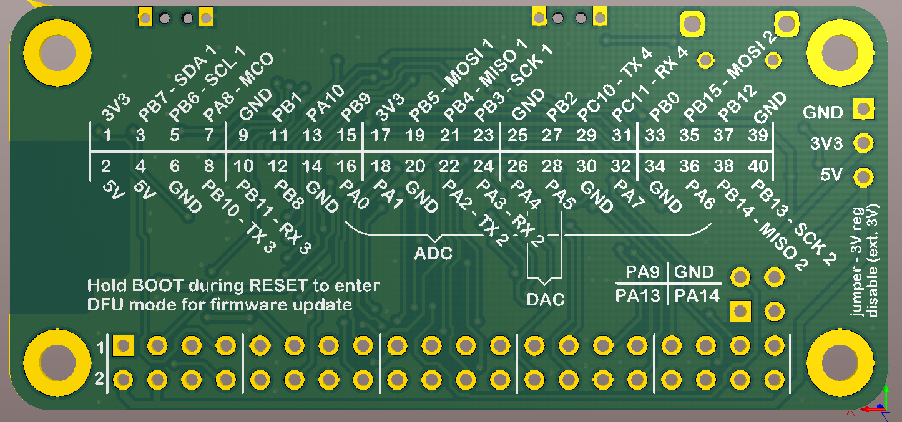

GEX Zero
========

This form factor is designed to be mechanically compatible with the
Raspberry Pi Zero (W). This makes it possible to use PHATs and cases for the Pi Zero.

Pins are mapped to the 20x2 header to maximize compatibility with PHATS. 
Functions like UART, SPI and I2C should all be available.






## Pin mapping

### Main header

```none

 3V3   1 | 2   5V
 PB7   3 | 4   5V
 PB6   5 | 6   GND
 PA8   7 | 8   PB10
 GND   9 | 10  PB11
 PB1  11 | 12  PB8
PA10  13 | 14  GND
 PB9  15 | 16  PA0
 3V3  17 | 18  PA1
 PB5  19 | 20  GND
 PB4  21 | 22  PA2
 PB3  23 | 24  PA3
 GND  25 | 26  PA4
 PB2  27 | 28  PA5
PC10  29 | 30  GND
PC11  31 | 32  PA7
 PB0  33 | 34  GND
PB15  35 | 36  PA6
PB12  37 | 38  PB14
 GND  39 | 40  PB13

```

### Small header

GND, Debug TX (PA9), PA13, PA14 (SWD)

## Radio interface

This board has a position for NRF24L01+.

The radio module uses one of the SPI ports as alternate functions on some otherwise unused PC pins.
PB12 and PB14 can only be used as regular GPIO when the radio link is enabled, not SPI. PB13 must be 
left unconnected, as there is no available remap for the clock line.

The radio module is used for remote control with the GEX Dongle and provides a fast, half duplex connection.

## BUGS

- One of the I2C pull-ups is at the wrong pin in the header (off by one, easy fix by cutting a trace and shorting with solder)
- Pins PB15 and PB14 should be swapped in the connector for SPI pHATs compatibility (when the bototm SPI port is used)
