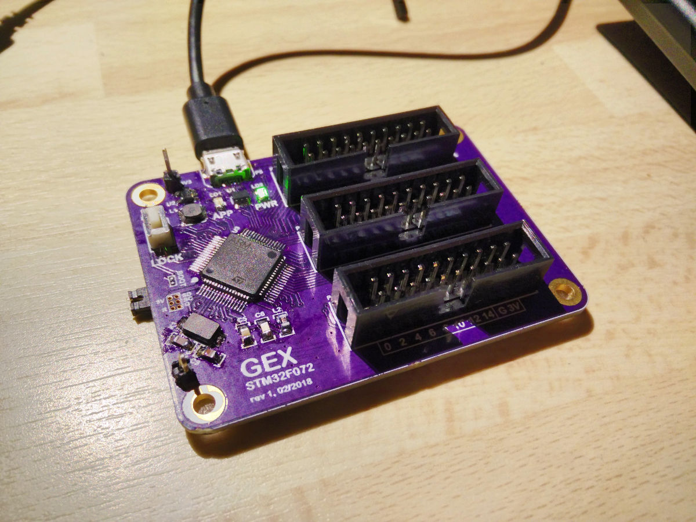

GEX F072 hub prototype board
============================

This board was the first custom PCB for GEX.

To flash a firmware, remove JP1, reset and flash using DFU. Replace JP1 and reset for normal operation.

Press and hold S1 to enable USB VFS with config files. Same process for locking and persisting to Flash.
Settings (but not system settings) can also be changed via the USB API.

Errata
------

*which is an euphemnism for bugs*

- JP1 - bad footprint, too fine pitch. Can be fixed by soldering the header on the bottom, with slightly bent pins
- P1 - the SWD connector, same problem, no fix needed or available. Use DFU for flashing
- Missign NRESET button. Normally not needed, but often missed. You can solder it on the bottom side from one end of R2 to the GND testpoint.

